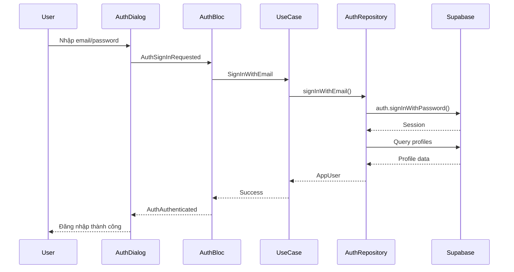

# Feature: Authentication (Xác Thực)

## 1. Mô Tả
Quản lý đăng nhập, đăng ký và trạng thái xác thực của người dùng sử dụng Supabase Auth.

## 2. Use Cases

### 2.1 Đăng Nhập
**Use Case:** `SignInWithEmail`
**File:** `lib/features/auth/domain/usecases/sign_in_with_email.dart`

**Luồng xử lý:**
1. User nhập email & password
2. Gọi `AuthRepository.signInWithEmail()`
3. Supabase Auth xác thực
4. Trả về `AppUser` entity
5. Lưu session vào state

**Lỗi có thể xảy ra:**
- Invalid credentials
- User not found
- Network error

### 2.2 Đăng Ký
**Use Case:** `SignUpWithEmail`
**File:** `lib/features/auth/domain/usecases/sign_up_with_email.dart`

**Luồng xử lý:**
1. User nhập email, password, username
2. Gọi `AuthRepository.signUpWithEmail()`
3. Supabase tạo user trong `auth.users`
4. Tạo profile trong `profiles` table
5. Trả về `AppUser` entity

### 2.3 Đăng Xuất
**Use Case:** `SignOut`
**File:** `lib/features/auth/domain/usecases/sign_out.dart`

**Luồng xử lý:**
1. Gọi `AuthRepository.signOut()`
2. Supabase xóa session
3. Xóa user data khỏi app
4. Sync guest comments nếu có

### 2.4 Lấy User Hiện Tại
**Use Case:** `GetCurrentUser`
**File:** `lib/features/auth/domain/usecases/get_current_user.dart`

**Luồng xử lý:**
1. Kiểm tra Supabase session
2. Lấy user từ `auth.currentUser`
3. Lấy profile từ `profiles` table
4. Trả về `AppUser` hoặc null

## 3. State Management

### AuthBloc States:
```dart
AuthInitial       → Trạng thái ban đầu
AuthLoading       → Đang xử lý
AuthAuthenticated → Đã đăng nhập ( có AppUser )
AuthUnauthenticated → Chưa đăng nhập
AuthError         → Lỗi ( message )
```

### AuthBloc Events:
```dart
AuthCheckRequested        → Kiểm tra trạng thái đăng nhập
AuthSignInRequested       → Yêu cầu đăng nhập
AuthSignUpRequested       → Yêu cầu đăng ký
AuthSignOutRequested      → Yêu cầu đăng xuất
AuthSyncGuestComments     → Sync comments của khách
```

## 4. UI Components

### AuthDialog
**File:** `lib/features/auth/presentation/widgets/auth_dialog.dart`

**Chức năng:**
- Tab Login/Register
- Form validation
- Error display
- Loading state
- Guest comment sync notification

## 5. Data Models

### AppUser Entity
```dart
class AppUser {
  final String id;
  final String email;
  final String? userName;
  final String? avatarUrl;
}
```

## 6. Repository Interface

```dart
abstract class AuthRepository {
  Future<Either<Failure, AppUser>> signInWithEmail(String email, String password);
  Future<Either<Failure, AppUser>> signUpWithEmail(String email, String password, String userName);
  Future<Either<Failure, void>> signOut();
  Future<Either<Failure, AppUser?>> getCurrentUser();
}
```

## 7. Supabase Integration

### Tables:
- **auth.users**: Managed by Supabase Auth
- **profiles**: Custom profile data
  - id (PK, FK to auth.users)
  - user_name
  - avatar_url
  - created_at

### Policies:
- Users can read all profiles
- Users can only update their own profile

## 8. Guest Mode Support

**Chức năng:** Cho phép khách bình luận local, khi đăng nhập sẽ sync lên server.

**Luồng:**
1. Guest bình luận → Lưu local (Hive)
2. Guest đăng nhập → Gọi `syncGuestComments`
3. Upload local comments lên server
4. Clear local storage

## 9. Sequence Diagram



## 10. Activity Diagram

```mermaid
activityDiagram
    start
    :User mở app;
    :AuthCheckRequested;
    if (Có session?) then (yes)
        :GetCurrentUser;
        :Emit AuthAuthenticated;
    else (no)
        :Emit AuthUnauthenticated;
    endif
    
    if (User bấm đăng nhập?) then (yes)
        :Hiển thị AuthDialog;
        :Nhập credentials;
        if (Valid?) then (yes)
            :SignInWithEmail;
            :AuthAuthenticated;
            if (Có guest comments?) then (yes)
                :SyncGuestComments;
            endif
        else (no)
            :Show error;
        endif
    endif
    stop
```

## 11. Testing

### Unit Tests:
- AuthBloc state transitions
- Use case logic
- Repository error handling

### Widget Tests:
- AuthDialog UI
- Form validation
- Error display

## 12. Còn Thiếu / Cần Bổ Sung

- [ ] Quên mật khẩu (Password reset)
- [ ] Đăng nhập bằng Google/Facebook (OAuth)
- [ ] Xác thực email (Email verification)
- [ ] Thay đổi mật khẩu
- [ ] Cập nhật profile (avatar, username)
- [ ] Delete account
- [ ] Auth persistence improvements
- [ ] Biometric authentication (fingerprint/face)
