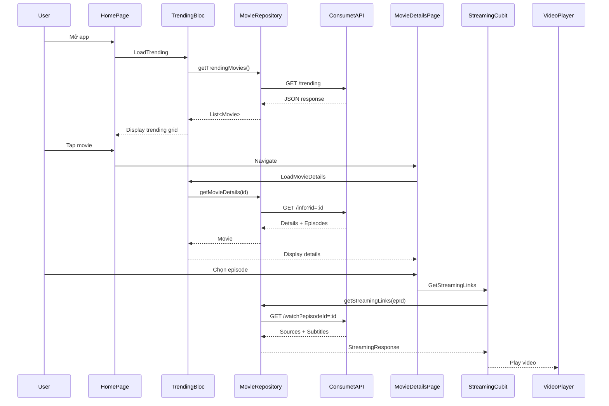

# Feature: Movies & Search (Phim & Tìm Kiếm)

## 1. Mô Tả
Hiển thị danh sách phim, trending, tìm kiếm và chi tiết phim. Sử dụng Consumet API làm nguồn dữ liệu.

## 2. Use Cases

### 2.1 Lấy Trending Movies
**Use Case:** `GetTrendingMovies`
**File:** `lib/features/movies/domain/usecases/get_trending_movies.dart`

**Luồng:**
1. Check cache (local)
2. Nếu có cache → Trả về cache
3. Nếu không → Gọi API `/trending`
4. Parse JSON → Movie entities
5. Lưu cache
6. Trả về danh sách

**API Endpoint:** `GET /trending`

### 2.2 Tìm Kiếm Phim
**Use Case:** `SearchMovies`
**File:** `lib/features/movies/domain/usecases/search_movies.dart`

**Luồng:**
1. User nhập query
2. Debounce 500ms
3. Gọi API `/search/:query`
4. Parse results
5. Hiển thị danh sách

**API Endpoint:** `GET /search/:query`

### 2.3 Chi Tiết Phim
**Use Case:** `GetMovieDetails`
**File:** `lib/features/movies/domain/usecases/get_movie_details.dart`

**Luồng:**
1. Gọi API `/info?id=:id`
2. Parse detailed info:
   - Title, description, rating
   - Episodes list (nếu là TV Series)
   - Seasons
   - Server list
3. Trả về Movie entity đầy đủ

**API Endpoint:** `GET /info?id=:id`

### 2.4 Lấy Streaming Links
**Use Case:** `GetStreamingLinks`
**File:** `lib/features/movies/domain/usecases/get_streaming_links.dart`

**Luồng:**
1. User chọn episode
2. Gọi API `/watch?episodeId=:id`
3. Parse streaming sources
4. Parse subtitles
5. Trả về cho Video Player

**API Endpoint:** `GET /watch?episodeId=:id`

## 3. State Management

### TrendingMoviesBloc:
```dart
TrendingMoviesInitial
TrendingMoviesLoading
TrendingMoviesLoaded(List<Movie> movies)
TrendingMoviesError(String message)
```

### SearchBloc:
```dart
SearchInitial
SearchLoading
SearchLoaded(List<Movie> movies)
SearchError(String message)
```

### MovieDetailsBloc:
```dart
MovieDetailsInitial
MovieDetailsLoading
MovieDetailsLoaded(Movie movie, List<Episode> episodes)
MovieDetailsError(String message)
```

## 4. UI Components

### HomePage
**File:** `lib/features/movies/presentation/pages/home_page.dart`

**Sections:**
1. **Featured/Trending**: Carousel phim nổi bật
2. **Trending Grid**: Grid 2-3 cột hiển thị phim trending
3. **Featured Comment Banner**: Hiển thị bình luận nổi bật từ users
4. **Categories**: Chips chuyên mục nhanh

### MovieCard
**File:** `lib/features/movies/presentation/widgets/movie_card.dart`

**Hiển thị:**
- Poster image (cached)
- Title
- Rating/Year
- Type badge (Movie/TV Series)
- Shimmer loading effect

### MovieDetailsPage
**File:** `lib/features/movies/presentation/pages/movie_details_page.dart`

**Sections:**
1. **Header**: Backdrop image, title, rating
2. **Info Section**: Description, cast, genres, year
3. **Season Selector**: Dropdown chọn season (TV Series)
4. **Episode List**: List episodes theo season
5. **Server Selector**: Chọn server streaming
6. **Play Button**: Bắt đầu xem
7. **Favorite Button**: Thêm/xóa khỏi danh sách yêu thích

### SearchPage
**File:** `lib/features/movies/presentation/pages/search_page.dart`

**Features:**
- Search bar with debounce
- Search suggestions (optional)
- Results grid/list
- Empty state
- Loading shimmer

### TrendingCarousel
**File:** `lib/features/movies/presentation/widgets/trending_carousel.dart`

**Features:**
- Auto-scroll carousel
- Page indicator
- Hero animation
- Tap to view details

## 5. Data Models

### Movie Entity
```dart
class Movie {
  final String id;
  final String title;
  final String? description;
  final String? image;
  final String? cover;
  final String? rating;
  final String? releaseDate;
  final String? type; // 'TV Series' | 'Movie'
  final List<String>? genres;
  final List<Episode>? episodes;
}
```

### Episode Entity
```dart
class Episode {
  final String id;
  final String title;
  final String? number;
  final String? season;
  final String? description;
}
```

### StreamingLink Entity
```dart
class StreamingLink {
  final String url;
  final String quality;
  final bool isM3U8;
  final Map<String, String> headers;
}
```

## 6. Repository

```dart
abstract class MovieRepository {
  Future<Either<Failure, List<Movie>>> getTrendingMovies();
  Future<Either<Failure, List<Movie>>> searchMovies(String query);
  Future<Either<Failure, Movie>> getMovieDetails(String id, String type);
  Future<Either<Failure, StreamingResponse>> getStreamingLinks(String episodeId);
}
```

## 7. API Integration

### Consumet API:
- **Base URL**: Configured in API constants
- **Endpoints**:
  - `/trending` - Trending movies
  - `/search/:query` - Search
  - `/info?id=:id` - Movie details
  - `/watch?episodeId=:id` - Streaming links

### Caching Strategy:
- Trending: Cache 1 hour
- Search: No cache (real-time)
- Details: Cache 30 minutes

## 8. Sequence Diagram - Watch Movie Flow



## 9. Activity Diagram - Search Flow

```mermaid
activityDiagram
    start
    :User vào SearchPage;
    :Hiển thị search bar;
    
    while (User typing?) is (yes)
        :Debounce 500ms;
        if (Query length > 2?) then (yes)
            :Emit SearchLoading;
            :Call API /search/:query;
            if (Success?) then (yes)
                :Emit SearchLoaded;
                :Display results;
            else (no)
                :Emit SearchError;
                :Show error message;
            endif
        endif
    endwhile (no)
    
    if (User tap movie?) then (yes)
        :Navigate to MovieDetails;
    endif
    stop
```

## 10. Testing

### Unit Tests:
- API parsing
- Repository error handling
- Caching logic
- Debounce search

### Widget Tests:
- MovieCard rendering
- MovieDetailsPage sections
- SearchPage flow
- Carousel navigation

### Integration Tests:
- End-to-end: Search → Details → Play
- Pull-to-refresh trending

## 11. Còn Thiếu / Cần Bổ Sung

- [ ] Filters (year, genre, rating)
- [ ] Sort options (newest, rating, views)
- [ ] Advanced search (by actor, director)
- [ ] Recommendations ("You might also like")
- [ ] Related movies
- [ ] Cast & crew details
- [ ] Reviews from external sources (IMDb, etc.)
- [ ] Download for offline viewing
- [ ] Continue watching (resume from timestamp)
- [ ] Watchlist (different from favorites)
- [ ] Recently added section
- [ ] Coming soon / Upcoming
