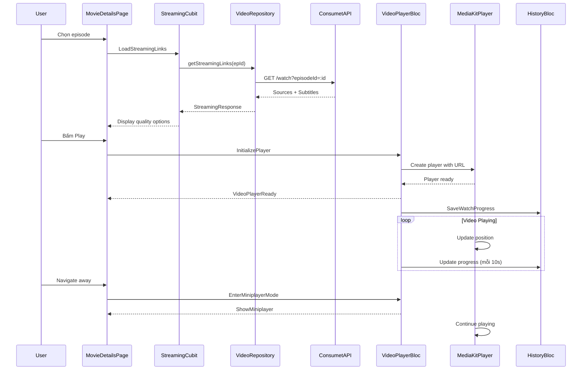

# Feature: Video Player

## 1. Mô Tả
Trình phát video với các tính năng nâng cao: miniplayer, custom controls, subtitles, và quản lý trạng thái phát.

## 2. Architecture

### Components:
1. **VideoPlayerBloc**: Quản lý state phát video
2. **MiniplayerWidget**: Player thu nhỏ khi navigate
3. **VideoPlayerContent**: Player toàn màn hình
4. **CustomVideoControls**: Controls tùy chỉnh
5. **StreamingCubit**: Quản lý streaming links

## 3. Use Cases

### 3.1 Khởi Động Video
**Luồng:**
1. User chọn episode
2. `StreamingCubit` gọi API lấy links
3. Parse sources và subtitles
4. Khởi tạo `media_kit` player
5. Phát video với source tốt nhất
6. Lưu progress vào `HistoryBloc`

### 3.2 Chuyển Episode
**Luồng:**
1. User chọn episode khác
2. Dispose player hiện tại
3. Lưu progress episode cũ
4. Load links episode mới
5. Khởi động player mới

### 3.3 Miniplayer Mode
**Luồng:**
1. User navigate away từ player
2. Player chuyển sang miniplayer
3. Video tiếp tục phát (nhỏ gọn)
4. Tap để mở lại toàn màn hình
5. Swipe down để đóng

## 4. State Management

### VideoPlayerBloc States:
```dart
VideoPlayerInitial
VideoPlayerLoading
VideoPlayerReady(Player player, List<Subtitle> subtitles)
VideoPlayerPlaying
VideoPlayerPaused
VideoPlayerBuffering
VideoPlayerError(String message)
VideoPlayerDisposed
```

### VideoPlayerEvents:
```dart
InitializePlayer(String url, Map<String, String> headers)
Play()
Pause()
Seek(Duration position)
ChangeQuality(String quality)
ToggleSubtitle(bool show)
SelectSubtitle(String language)
EnterFullscreen()
ExitFullscreen()
DisposePlayer()
```

### StreamingCubit States:
```dart
StreamingInitial
StreamingLoading
StreamingLoaded(List<StreamingLink> links, List<Subtitle> subtitles)
StreamingError(String message)
```

## 5. UI Components

### VideoPlayerContent
**File:** `lib/features/video_player/presentation/widgets/video_player_content.dart`

**Features:**
- Fullscreen video display
- Custom controls overlay
- Gesture detection (tap, double tap)
- Progress bar
- Volume/Brightness indicators
- Subtitle display

### MiniplayerWidget
**File:** `lib/features/video_player/presentation/widgets/miniplayer_widget.dart`

**Features:**
- Picture-in-picture style
- Draggable position
- Play/pause button
- Close button
- Expand on tap
- Thumbnail + title

### CustomVideoControls
**File:** `lib/features/video_player/presentation/widgets/custom_video_controls.dart`

**Controls:**
- Play/Pause button
- Progress slider
- Current time / Total time
- Fullscreen toggle
- Quality selector (nếu có nhiều sources)
- Subtitle toggle
- Volume control
- Back button

## 6. Data Models

### StreamingLink
```dart
class StreamingLink {
  final String url;
  final String quality; // '720p', '1080p', '4K'
  final bool isM3U8;
  final Map<String, String> headers;
}
```

### Subtitle
```dart
class Subtitle {
  final String language; // 'Vietnamese', 'English'
  final String url;
  final String? code; // 'vi', 'en'
}
```

## 7. Video Player Features

### 7.1 Playback Controls
- Play/Pause
- Seek forward/backward (10s)
- Seek to position
- Change playback speed (0.5x, 1x, 1.5x, 2x)

### 7.2 Quality Management
- Auto-select best quality
- Manual quality switch
- Quality based on network

### 7.3 Subtitles
- Auto-load subtitles từ API
- Toggle on/off
- Language selection
- Font size adjustment

### 7.4 Gestures
- Tap: Show/hide controls
- Double tap left/right: Seek +/- 10s
- Vertical left: Brightness
- Vertical right: Volume
- Horizontal: Seek
- Pinch: Zoom (nếu supported)

### 7.5 Background Play
- Tiếp tục phát khi app background
- Notification controls

### 7.6 Screen Management
- Keep screen on (wakelock)
- Auto-rotate
- Fullscreen mode
- System UI hide/show

## 8. Repository

```dart
abstract class VideoRepository {
  Future<Either<Failure, StreamingResponse>> getStreamingLinks(
    String episodeId, {
    String? server,
  });
}
```

## 9. Sequence Diagram - Video Playback



## 10. Activity Diagram - Player Controls

```mermaid
activityDiagram
    start
    :Video đang phát;
    
    if (User tap màn hình?) then (yes)
        :Show controls overlay;
        if (User tap again?) then (yes)
            :Hide controls;
        else (no - sau 3s)
            :Auto-hide controls;
        endif
    endif
    
    if (User double tap left?) then (yes)
        :Seek backward 10s;
        :Show seek indicator;
    endif
    
    if (User double tap right?) then (yes)
        :Seek forward 10s;
        :Show seek indicator;
    endif
    
    if (User swipe vertical left?) then (yes)
        :Adjust brightness;
        :Show brightness indicator;
    endif
    
    if (User swipe vertical right?) then (yes)
        :Adjust volume;
        :Show volume indicator;
    endif
    
    if (User bấm fullscreen?) then (yes)
        :Toggle fullscreen mode;
        :Update system UI;
    endif
    
    if (Video end?) then (yes)
        :Show replay button;
        :Auto-play next episode (nếu có);
    endif
    
    stop
```

## 11. Testing

### Unit Tests:
- Player state management
- Streaming link parsing
- Subtitle loading
- Progress tracking

### Widget Tests:
- Controls rendering
- Gesture handling
- Miniplayer behavior
- Fullscreen toggle

### Integration Tests:
- Play → Pause → Seek flow
- Quality switching
- Subtitle display
- Background play

## 12. Còn Thiếu / Cần Bổ Sung

- [ ] Cast to TV (Chromecast, AirPlay)
- [ ] Picture-in-picture mode (system PiP)
- [ ] Audio track selection (multi-audio)
- [ ] Video zoom modes (fit, fill, stretch)
- [ ] Screenshot feature
- [ ] Sleep timer
- [ ] Auto-skip intro/outro
- [ ] Next episode countdown
- [ ] Playlist/queue management
- [ ] Audio boost/normalization
- [ ] Subtitle synchronization adjustment
- [ ] Custom subtitle styling (color, font, position)
- [ ] Buffer size configuration
- [ ] Download for offline
- [ ] Hardware acceleration toggle
- [ ] Network usage statistics
