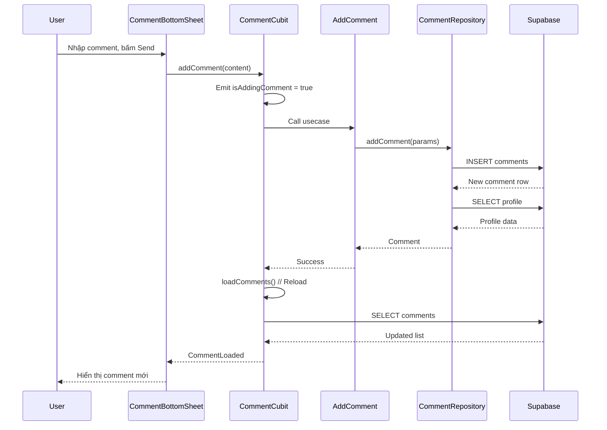
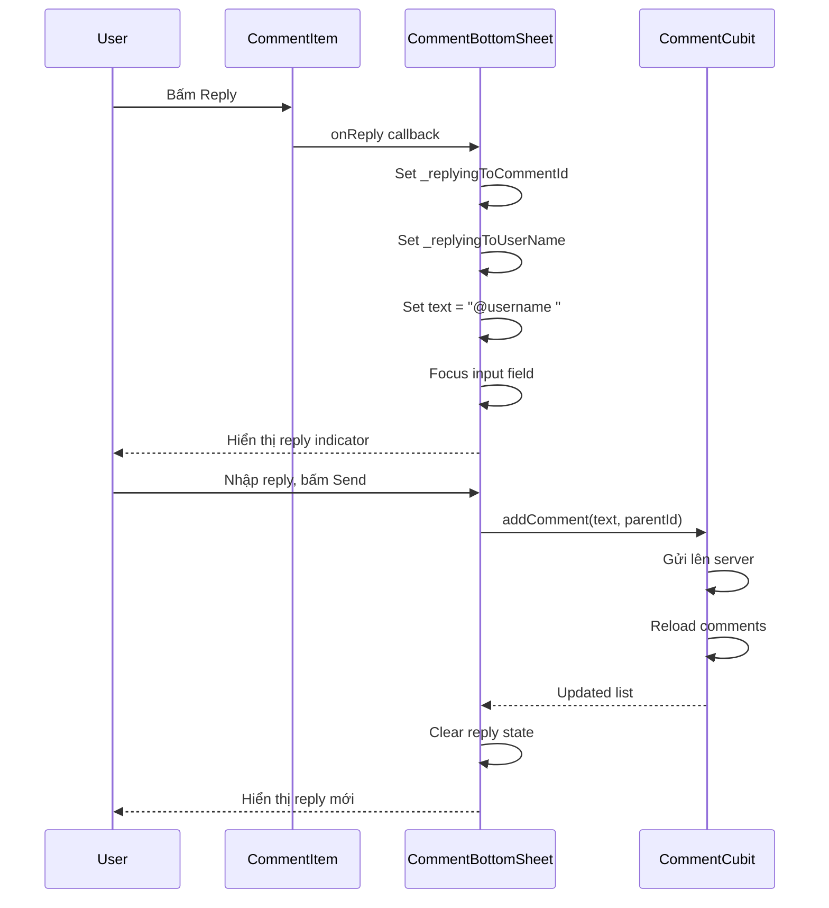

# Feature: Comments (Bình Luận)

## 1. Mô Tả
Hệ thống bình luận với nested replies, likes, trending, và guest support. Backend sử dụng Supabase.

## 2. Use Cases

### 2.1 Lấy Danh Sách Bình Luận
**Use Case:** `GetComments`
**File:** `lib/features/comments/domain/usecases/get_comments.dart`

**Luồng:**
1. Gọi `CommentRepository.getComments(videoId)`
2. Fetch comments từ Supabase (root comments only, parent_id = null)
3. Join với `profiles` table để lấy user info
4. Merge data và trả về entities
5. Sort theo is_pinned (desc) và created_at (desc)

**Supabase Query:**
```sql
SELECT * FROM comments 
WHERE video_id = ? AND is_deleted = false AND parent_id IS NULL
ORDER BY is_pinned DESC, created_at DESC
```

### 2.2 Thêm Bình Luận
**Use Case:** `AddComment`
**File:** `lib/features/comments/domain/usecases/add_comment.dart`

**Luồng:**
1. Kiểm tra authentication
2. Insert vào `comments` table
3. Trả về comment mới với profile info
4. Reload danh sách comments

**Supabase:**
```sql
INSERT INTO comments (video_id, user_id, content, parent_id, created_at)
VALUES (?, ?, ?, ?, NOW())
```

### 2.3 Like/Unlike Bình Luận
**Use Case:** `LikeComment`
**File:** `lib/features/comments/domain/usecases/like_comment.dart`

**Luồng:**
1. Kiểm tra user đã like chưa
2. Nếu đã like → Remove (unlike)
3. Nếu chưa like → Insert
4. Update `likes` count trong `comments` table
5. Optimistic update UI

**Toggle Logic:**
```dart
if (existing != null) {
  // Unlike
  DELETE FROM comment_likes WHERE comment_id = ? AND user_id = ?
} else {
  // Like
  INSERT INTO comment_likes (comment_id, user_id, created_at)
}
```

### 2.4 Lấy Replies
**Use Case:** `GetReplies`
**File:** `lib/features/comments/domain/usecases/get_replies.dart`

**Luồng:**
1. User tap "Xem replies"
2. Fetch replies cho comment_id
3. Sắp xếp theo created_at ASC
4. Expand/collapse animation

### 2.5 Lấy Trending Comments
**Use Case:** `GetTrendingComments`
**File:** `lib/features/home_trending_section.dart`

**Luồng:**
1. Query comments trong 7 ngày qua
2. Order by likes DESC
3. Limit 5 comments
4. Hiển thị trên home page

**Supabase:**
```sql
SELECT * FROM comments 
WHERE parent_id IS NULL 
  AND is_deleted = false 
  AND created_at > NOW() - INTERVAL '7 days'
ORDER BY likes DESC 
LIMIT 5
```

## 3. State Management

### CommentCubit States:
```dart
CommentInitial
CommentLoading
CommentLoaded(
  List<Comment> comments,
  CommentSortType sortType,
  Map<String, List<Comment>> expandedReplies,
  bool isAddingComment,
  String? errorMessage,
  Set<String> likedCommentIds,  // Theo dõi comment đã like
  Set<String> likingInProgress, // Prevent spam
)
CommentError(String message)
```

### CommentSortType:
```dart
enum CommentSortType { newest, trending }
```

### HomeTrendingCubit States:
```dart
HomeTrendingInitial
HomeTrendingLoading
HomeTrendingLoaded(List<Comment> comments)
HomeTrendingEmpty
HomeTrendingError(String message)
```

## 4. UI Components

### CommentBottomSheet
**File:** `lib/features/comments/presentation/widgets/comment_bottom_sheet.dart`

**Features:**
- Draggable scrollable sheet
- Header với comment count
- Sort tabs (Trending/Newest)
- Comment list
- Reply indicator (khi đang trả lời)
- Input field

### CommentItem
**File:** `lib/features/comments/presentation/widgets/comment_item.dart`

**Features:**
- Avatar + username + time
- Comment text (expandable nếu > 120 chars)
- Like button với count
- Reply button
- Replies toggle (nếu có replies)
- Nested replies display
- Pinned badge (nếu is_pinned)

### CommentInput
**File:** `lib/features/comments/presentation/widgets/comment_input.dart`

**Features:**
- Text field
- Send button
- Avatar của current user
- Hint text

### HomeTrendingSection
**File:** `lib/features/comments/presentation/widgets/home_trending_section.dart`

**Features:**
- Horizontal scrolling list
- Trending cards (nhỏ gọn)
- User info + trending score
- Tap để navigate đến video

## 5. Data Models

### Comment Entity
```dart
class Comment {
  final String id;
  final String videoId;
  final String userName;
  final String avatarUrl;
  final String content;
  final int likes;
  final int dislikes;
  final int repliesCount;
  final DateTime createdAt;
  final String? parentId;
  final String? mediaType;
  final bool isEdited;
  final bool isDeleted;
  final bool isPinned;
  final double trendingScore;
  final List<Comment> replies;  // Nested replies
  
  String get timeAgo => // Relative time (2h, 3d, 1w)
}
```

### CommentModel (Data Layer)
```dart
class CommentModel {
  // Same fields as entity
  Comment toEntity();
}
```

## 6. Repository

```dart
abstract class CommentRepository {
  Future<Either<Failure, List<Comment>>> getComments(String videoId);
  Future<Either<Failure, Comment>> addComment({
    required String videoId,
    required String content,
    String? parentId,
  });
  Future<Either<Failure, void>> likeComment(String commentId);
  Future<Either<Failure, void>> dislikeComment(String commentId);
  Future<Either<Failure, List<Comment>>> getReplies(String commentId);
  Future<Either<Failure, List<String>>> getLikedCommentIds(String videoId);
  Future<Either<Failure, List<Comment>>> getTrendingComments({int limit = 5});
}
```

## 7. Supabase Schema

### comments table:
```sql
CREATE TABLE comments (
  id UUID DEFAULT gen_random_uuid() PRIMARY KEY,
  video_id TEXT NOT NULL,
  user_id UUID REFERENCES auth.users(id),
  content TEXT NOT NULL,
  parent_id UUID REFERENCES comments(id),
  likes INTEGER DEFAULT 0,
  dislikes INTEGER DEFAULT 0,
  replies_count INTEGER DEFAULT 0,
  is_edited BOOLEAN DEFAULT false,
  is_deleted BOOLEAN DEFAULT false,
  is_pinned BOOLEAN DEFAULT false,
  created_at TIMESTAMP DEFAULT NOW(),
  updated_at TIMESTAMP
);
```

### comment_likes table:
```sql
CREATE TABLE comment_likes (
  comment_id UUID REFERENCES comments(id) ON DELETE CASCADE,
  user_id UUID REFERENCES auth.users(id) ON DELETE CASCADE,
  created_at TIMESTAMP DEFAULT NOW(),
  PRIMARY KEY (comment_id, user_id)
);
```

### comment_dislikes table:
```sql
CREATE TABLE comment_dislikes (
  comment_id UUID REFERENCES comments(id) ON DELETE CASCADE,
  user_id UUID REFERENCES auth.users(id) ON DELETE CASCADE,
  created_at TIMESTAMP DEFAULT NOW(),
  PRIMARY KEY (comment_id, user_id)
);
```

### profiles table:
```sql
CREATE TABLE profiles (
  id UUID REFERENCES auth.users(id) PRIMARY KEY,
  user_name TEXT,
  avatar_url TEXT,
  created_at TIMESTAMP DEFAULT NOW()
);
```

## 8. Guest Support

### LocalCommentDataSource
**File:** `lib/features/comments/data/datasources/local_comment_datasource.dart`

**Features:**
- Lưu comment local khi user chưa đăng nhập
- Sử dụng Hive database
- Sync lên server khi đăng nhập

**Luồng:**
1. Guest bình luận → Lưu local
2. Guest đăng nhập → Gọi `syncGuestComments`
3. Upload từng comment lên server
4. Mark as synced
5. Clear local storage

## 9. Sequence Diagram - Add Comment



## 10. Activity Diagram - Like/Unlike

```mermaid
activityDiagram
    start
    :User bấm Like;
    
    if (Đang xử lý?) then (yes)
        :Ignore (prevent spam);
        stop
    endif
    
    :Add to likingInProgress;
    :Emit state;
    
    if (Đã like trước đó?) then (yes)
        :Optimistic update: likes--;
        :Remove from likedCommentIds;
        :Gọi backend (unlike);
    else (no)
        :Optimistic update: likes++;
        :Add to likedCommentIds;
        :Gọi backend (like);
    endif
    
    :Remove from likingInProgress;
    :Emit updated state;
    stop
```

## 11. Sequence Diagram - Reply Flow



## 12. Testing

### Unit Tests:
- Comment parsing
- Like toggle logic
- Sort algorithms
- Trending score calculation

### Widget Tests:
- CommentItem display
- CommentBottomSheet interaction
- Reply flow
- Like button state

### Integration Tests:
- Add comment flow
- Reply flow
- Like/unlike flow
- Guest comment sync

## 13. Còn Thiếu / Cần Bổ Sung

- [ ] Edit comment (đã có is_edited flag nhưng chưa implement UI)
- [ ] Delete comment (soft delete, đã có is_deleted flag)
- [ ] Report comment
- [ ] Block user
- [ ] Rich text support (bold, italic, links)
- [ ] Emoji picker
- [ ] Image attachments
- [ ] Real-time updates (Supabase realtime)
- [ ] Push notifications cho replies
- [ ] @mentions với autocomplete
- [ ] Comment threads pagination (replies > 10)
- [ ] Comment history/versioning
- [ ] Spam detection/filtering
- [ ] Moderator tools (pin, unpin, delete)
- [ ] Comment templates/canned responses
- [ ] Upvote/Downvote system (thay vì chỉ like)
- [ ] Comment awards/gifts
- [ ] Private comments (chỉ người tạo video xem được)
