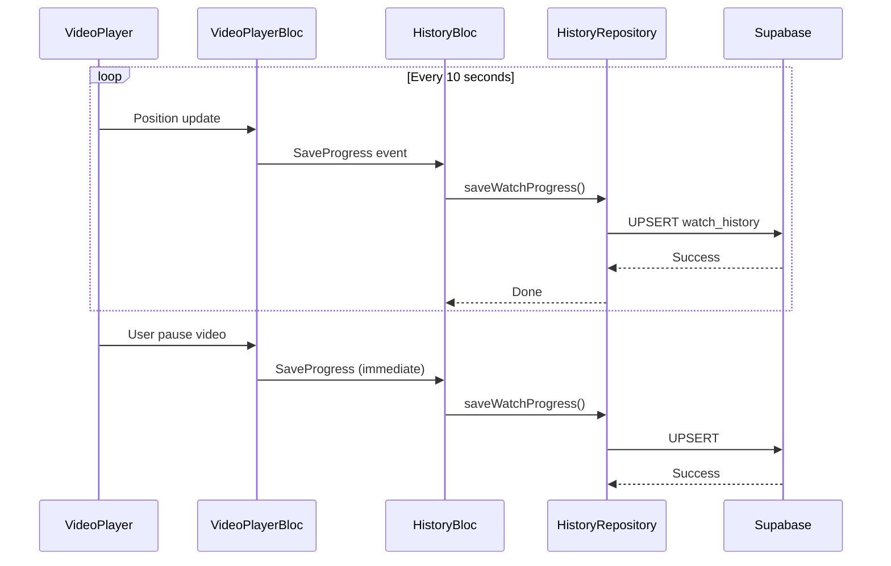

# Feature: Favorites & History

## 1. Favorites (Danh Sách Yêu Thích)

### 1.1 Mô Tả
Cho phép users lưu phim yêu thích và xem lại sau. Sync với Supabase.

### 1.2 Use Cases

#### Add Favorite
**File:** `lib/features/favorites/domain/usecases/add_favorite.dart`

**Luồng:**
1. User bấm favorite button
2. Gọi `FavoritesRepository.addFavorite(movie)`
3. Insert vào Supabase `favorites` table
4. Optimistic update UI
5. Show success toast

#### Remove Favorite
**File:** `lib/features/favorites/domain/usecases/remove_favorite.dart`

**Luồng:**
1. User bấm unfavorite
2. Gọi `FavoritesRepository.removeFavorite(movieId)`
3. Delete từ Supabase
4. Update UI

#### Get Favorites
**File:** `lib/features/favorites/domain/usecases/get_favorites.dart`

**Luồng:**
1. Mở FavoritesPage
2. Gọi `FavoritesRepository.getFavorites()`
3. Query Supabase theo user_id
4. Order by added_at DESC
5. Hiển thị grid/list

#### Check Is Favorite
**File:** `lib/features/favorites/domain/usecases/is_favorite.dart`

**Luồng:**
1. Mở MovieDetailsPage
2. Kiểm tra movie có trong favorites không
3. Update favorite button icon (filled/outline)

### 1.3 State Management

#### FavoritesBloc States:
```dart
FavoritesInitial
FavoritesLoading
FavoritesLoaded(List<Favorite> favorites)
FavoritesError(String message)
```

#### FavoritesBloc Events:
```dart
LoadFavorites()
AddFavorite(Movie movie)
RemoveFavorite(String movieId)
CheckIsFavorite(String movieId)
```

### 1.4 UI Components

#### FavoritesPage
**File:** `lib/features/favorites/presentation/pages/favorites_page.dart`

**Features:**
- Grid hiển thị phim yêu thích
- Pull-to-refresh
- Empty state (nếu chưa có phim nào)
- Long press để remove
- Sort options (newest, alphabetical)

#### FavoriteButton
**File:** `lib/features/favorites/presentation/widgets/favorite_button.dart`

**Features:**
- Heart icon (filled/outline)
- Loading state
- Animation khi tap
- Yêu cầu đăng nhập (nếu guest)

### 1.5 Data Model

```dart
class Favorite {
  final String id;
  final String userId;
  final String movieId;
  final Movie movieData;  // Full movie JSON
  final DateTime addedAt;
}
```

### 1.6 Repository

```dart
abstract class FavoritesRepository {
  Future<Either<Failure, void>> addFavorite(Movie movie);
  Future<Either<Failure, void>> removeFavorite(String movieId);
  Future<Either<Failure, List<Favorite>>> getFavorites();
  Future<Either<Failure, bool>> isFavorite(String movieId);
}
```

### 1.7 Supabase Schema

```sql
CREATE TABLE favorites (
  id UUID DEFAULT gen_random_uuid() PRIMARY KEY,
  user_id UUID REFERENCES auth.users(id) ON DELETE CASCADE,
  movie_id TEXT NOT NULL,
  movie_data JSONB NOT NULL,  -- Full movie object
  added_at TIMESTAMP DEFAULT NOW(),
  UNIQUE(user_id, movie_id)
);

-- Policy: Users can only access their own favorites
CREATE POLICY "Users can manage own favorites" ON favorites
  FOR ALL USING (auth.uid() = user_id);
```

---

## 2. History (Lịch Sử Xem)

### 2.1 Mô Tả
Theo dõi lịch sử xem phim và tiến độ xem để "Continue Watching".

### 2.2 Use Cases

#### Save Watch Progress
**File:** `lib/features/history/domain/usecases/save_watch_progress.dart`

**Luồng:**
1. Video đang phát
2. Mỗi 10 giây/lúc pause → Lưu progress
3. Gọi `HistoryRepository.saveProgress()`
4. Upsert vào Supabase
5. Update UI (nếu đang ở RecentlyWatchedPage)

#### Get Watch History
**File:** `lib/features/history/domain/usecases/get_watch_history.dart`

**Luồng:**
1. Mở RecentlyWatchedPage
2. Gọi `HistoryRepository.getHistory()`
3. Query Supabase theo user_id
4. Order by last_watched DESC
5. Group by movie (hiển thị episode gần nhất)

#### Delete Watch Progress
**File:** `lib/features/history/domain/usecases/delete_watch_progress.dart`

**Luồng:**
1. User swipe/delete item
2. Gọi `HistoryRepository.deleteProgress()`
3. Delete từ Supabase
4. Update UI

### 2.3 State Management

#### HistoryBloc States:
```dart
HistoryInitial
HistoryLoading
HistoryLoaded(List<WatchProgress> history)
HistoryError(String message)
```

#### HistoryBloc Events:
```dart
LoadHistory()
SaveProgress(String videoId, Duration position, Duration duration)
DeleteProgress(String videoId)
ClearAllHistory()
```

### 2.4 UI Components

#### RecentlyWatchedPage
**File:** `lib/features/history/presentation/pages/recently_watched_page.dart`

**Features:**
- List các phim đã xem
- Progress bar (30%, 50%, etc.)
- "Continue watching" label
- Thumbnail + title + episode info
- Swipe to delete
- Clear all button
- Empty state

#### Progress Indicator
**Hiển thị trên:**
- MovieCard (nếu đã xem)
- RecentlyWatchedPage
- History items

### 2.5 Data Model

```dart
class WatchProgress {
  final String id;
  final String userId;
  final String videoId;
  final String movieId;
  final String? episodeId;
  final Duration position;  // Vị trí đang xem (seconds)
  final Duration duration;  // Tổng thời lượng
  final DateTime lastWatched;
  final Movie? movieData;   // Cached movie info
  
  double get progressPercent => position.inSeconds / duration.inSeconds;
  bool get isCompleted => progressPercent > 0.9;
}
```

### 2.6 Repository

```dart
abstract class HistoryRepository {
  Future<Either<Failure, void>> saveWatchProgress(WatchProgress progress);
  Future<Either<Failure, List<WatchProgress>>> getWatchHistory();
  Future<Either<Failure, void>> deleteWatchProgress(String videoId);
  Future<Either<Failure, void>> clearAllHistory();
  Future<Either<Failure, WatchProgress?>> getLastProgress(String videoId);
}
```

### 2.7 Supabase Schema

```sql
CREATE TABLE watch_history (
  id UUID DEFAULT gen_random_uuid() PRIMARY KEY,
  user_id UUID REFERENCES auth.users(id) ON DELETE CASCADE,
  video_id TEXT NOT NULL,
  movie_id TEXT NOT NULL,
  episode_id TEXT,
  position_seconds INTEGER DEFAULT 0,
  duration_seconds INTEGER,
  last_watched TIMESTAMP DEFAULT NOW(),
  movie_data JSONB,  -- Cached movie info
  UNIQUE(user_id, video_id)
);

-- Policy: Users can only access their own history
CREATE POLICY "Users can manage own history" ON watch_history
  FOR ALL USING (auth.uid() = user_id);

-- Index for faster queries
CREATE INDEX idx_watch_history_user_lastwatched 
  ON watch_history(user_id, last_watched DESC);
```

### 2.8 Auto-Save Progress

**Implementation:**
```dart
// In VideoPlayerBloc
Stream.periodic(Duration(seconds: 10)).listen((_) {
  if (isPlaying) {
    historyBloc.add(SaveProgress(
      videoId: currentVideoId,
      position: player.position,
      duration: player.duration,
    ));
  }
});
```

---

## 3. Sequence Diagram - Save Progress



## 4. Activity Diagram - Continue Watching

```mermaid
activityDiagram
    start
    :User mở app;
    :Check watch_history;
    
    if (Có phim chưa xem hết?) then (yes)
        :Hiển thị "Continue Watching" section;
        :Show progress bar (50%, 30%, etc.);
        
        if (User tap phim?) then (yes)
            :Navigate to player;
            :Load video;
            :Seek to saved position;
            :Tiếp tục xem;
        endif
    else (no)
        :Show trending/new releases;
    endif
    stop
```

## 5. Testing

### Unit Tests:
- Progress calculation
- Repository CRUD operations
- Duplicate handling (UPSERT)

### Widget Tests:
- FavoritesPage rendering
- RecentlyWatchedPage
- FavoriteButton states
- Progress bar display

### Integration Tests:
- Add/remove favorite flow
- Watch progress save/load
- Continue watching flow

## 6. Còn Thiếu / Cần Bổ Sung

### Favorites:
- [ ] Folders/categories trong favorites
- [ ] Notes cho từng phim yêu thích
- [ ] Share favorites list
- [ ] Import/export favorites
- [ ] Smart recommendations dựa trên favorites
- [ ] Public favorites (shareable link)
- [ ] Sync favorites across devices (đã có nhưng cần test)

### History:
- [ ] Watch time statistics (daily, weekly, monthly)
- [ ] Most watched genres
- [ ] Binge watching detection
- [ ] Auto-clear history sau X ngày
- [ ] Pause history tracking (incognito mode)
- [ ] Export watch history
- [ ] Rewatch detection
- [ ] History analytics dashboard
- [ ] "On this day" (what you watched 1 year ago)
