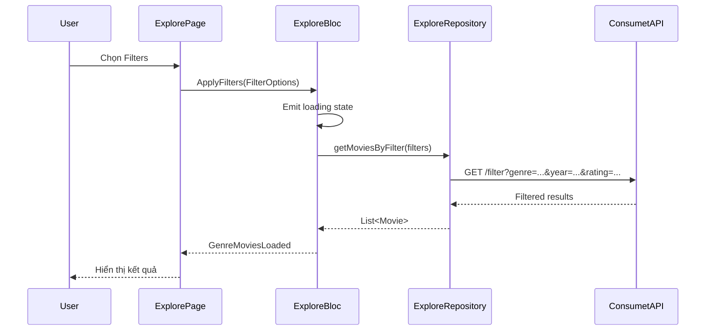

# Feature: Explore (Khám Phá) & Settings (Cài Đặt)

## 1. Explore (Khám Phá)

### 1.1 Mô Tả
Cho phép users khám phá phim theo thể loại (genres), bộ lọc, và categories.

### 1.2 Use Cases

#### Lấy Danh Sách Thể Loại
**Use Case:** `GetGenres`
**File:** `lib/features/explore/domain/usecases/get_genres.dart`

**Luồng:**
1. Mở ExplorePage
2. Gọi `ExploreRepository.getGenres()`
3. Fetch từ Consumet API hoặc cache
4. Hiển thị genre cards

#### Lọc Phim Theo Genre
**Use Case:** `GetMoviesByGenre`
**File:** `lib/features/explore/domain/usecases/get_movies_by_genre.dart`

**Luồng:**
1. User chọn genre
2. Navigate to GenreMoviesPage
3. Gọi API với genre ID
4. Hiển thị danh sách phim

#### Lọc Nâng Cao
**Use Case:** `GetMoviesByFilter`
**File:** `lib/features/explore/domain/usecases/get_movies_by_filter.dart`

**Luồng:**
1. User chọn nhiều filters (genre, year, rating, type)
2. Build filter query
3. Gọi API với filters
4. Hiển thị kết quả

### 1.3 State Management

#### ExploreBloc States:
```dart
ExploreInitial
ExploreLoading
ExploreLoaded(
  List<Genre> genres,
  List<Category> categories,
)
ExploreError(String message)
GenreMoviesLoading
GenreMoviesLoaded(List<Movie> movies, Genre genre)
```

#### ExploreBloc Events:
```dart
LoadExploreData()
SelectGenre(String genreId)
ApplyFilters(FilterOptions filters)
ClearFilters()
```

### 1.4 UI Components

#### ExplorePage
**File:** `lib/features/explore/presentation/pages/explore_page.dart`

**Features:**
- Search bar ở top
- Category chips (Movies, TV Series, Anime, etc.)
- Genre grid (2-3 columns)
- Trending section
- Recently added section

#### GenreCard
**File:** `lib/features/explore/presentation/widgets/genre_card.dart`

**Features:**
- Genre name
- Background image/icon
- Movie count (nếu có)
- Tap để xem phim thuộc genre

#### CategoryChip
**File:** `lib/features/explore/presentation/widgets/category_chip.dart`

**Features:**
- Horizontal scrollable chips
- Selected/unselected state
- Icons + text

#### GenreMoviesPage
**File:** `lib/features/explore/presentation/pages/genre_movies_page.dart`

**Features:**
- Genre name ở app bar
- Grid phim thuộc genre
- Pull-to-refresh
- Infinite scroll (pagination)
- Empty state
- Filter/Sort options

### 1.5 Data Models

```dart
class Genre {
  final String id;
  final String name;
  final String? image;
  final int? movieCount;
}

class Category {
  final String id;
  final String name;
  final IconData icon;
  final String type; // 'movie', 'tv', 'anime', etc.
}

class FilterOptions {
  final List<String>? genres;
  final int? year;
  final String? rating; // 'G', 'PG', 'R', etc.
  final String? type; // 'movie', 'tv_series'
  final String? sortBy; // 'popular', 'newest', 'rating'
}
```

### 1.6 Repository

```dart
abstract class ExploreRepository {
  Future<Either<Failure, List<Genre>>> getGenres();
  Future<Either<Failure, List<Category>>> getCategories();
  Future<Either<Failure, List<Movie>>> getMoviesByGenre(String genreId);
  Future<Either<Failure, List<Movie>>> getMoviesByFilter(FilterOptions filters);
}
```

---

## 2. Settings (Cài Đặt)

### 2.1 Mô Tả
Quản lý cài đặt ứng dụng, theme, ngôn ngữ, và thông tin ứng dụng.

### 2.2 Use Cases

#### Lấy Cài Đặt
**Use Case:** `GetSettings`
**File:** `lib/features/settings/domain/usecases/get_settings.dart`

**Luồng:**
1. Mở SettingsPage
2. Load từ local storage (SharedPreferences/Hive)
3. Hiển thị current settings

#### Lưu Cài Đặt
**Use Case:** `SaveSettings`
**File:** `lib/features/settings/domain/usecases/save_settings.dart`

**Luồng:**
1. User thay đổi setting
2. Save to local storage
3. Apply changes (theme, language)
4. Emit new state

### 2.3 State Management

#### SettingsBloc States:
```dart
SettingsInitial
SettingsLoading
SettingsLoaded(AppSettings settings)
SettingsError(String message)
SettingsUpdating
```

#### SettingsBloc Events:
```dart
LoadSettings()
UpdateTheme(ThemeMode mode)
UpdateLanguage(String languageCode)
UpdateNotifications(bool enabled)
UpdateQuality(String quality)
ClearCache()
```

### 2.4 UI Components

#### SettingsPage
**File:** `lib/features/settings/presentation/pages/settings_page.dart`

**Sections:**
1. **Account**
   - Profile info (nếu đăng nhập)
   - Edit profile
   - Change password
   - Logout

2. **Appearance**
   - Theme (Light/Dark/System)
   - Accent color
   - Font size

3. **Playback**
   - Default quality (Auto, 720p, 1080p)
   - Auto-play next episode
   - Picture-in-picture
   - Subtitle settings

4. **Notifications**
   - Push notifications toggle
   - New episodes alerts
   - Comment replies

5. **Storage**
   - Cache size display
   - Clear cache button
   - Download settings

6. **About**
   - App version
   - Terms of service
   - Privacy policy
   - Open source licenses
   - Contact/support

### 2.5 Data Model

```dart
class AppSettings {
  final ThemeMode themeMode;
  final String languageCode;
  final bool notificationsEnabled;
  final bool autoPlayNext;
  final String defaultQuality;
  final bool pictureInPicture;
  final double subtitleSize;
  final String subtitleColor;
  final bool useMobileData;
  final int maxCacheSizeMB;
  
  AppSettings copyWith({...});
}
```

### 2.6 Repository

```dart
abstract class SettingsRepository {
  Future<Either<Failure, AppSettings>> getSettings();
  Future<Either<Failure, void>> saveSettings(AppSettings settings);
  Future<Either<Failure, void>> clearCache();
  Future<Either<Failure, int>> getCacheSize();
}
```

### 2.7 Local Storage

**Implementation:**
```dart
class SettingsLocalDataSource {
  final SharedPreferences _prefs;
  
  AppSettings getSettings() {
    return AppSettings(
      themeMode: ThemeMode.values[_prefs.getInt('theme_mode') ?? 0],
      languageCode: _prefs.getString('language') ?? 'vi',
      notificationsEnabled: _prefs.getBool('notifications') ?? true,
      // ... other settings
    );
  }
  
  Future<void> saveSettings(AppSettings settings) async {
    await _prefs.setInt('theme_mode', settings.themeMode.index);
    await _prefs.setString('language', settings.languageCode);
    // ... save other fields
  }
}
```

---

## 3. Sequence Diagram - Filter Movies



## 4. Activity Diagram - Settings Flow

```mermaid
activityDiagram
    start
    :User mở SettingsPage;
    :LoadSettings từ local storage;
    :Hiển thị current settings;
    
    if (User thay đổi theme?) then (yes)
        :Chọn Light/Dark/System;
        :SaveSettings;
        :Apply theme immediately;
    endif
    
    if (User thay đổi language?) then (yes)
        :Chọn ngôn ngữ;
        :SaveSettings;
        :Reload app với locale mới;
    endif
    
    if (User clear cache?) then (yes)
        :Show confirmation dialog;
        if (Confirm?) then (yes)
            :ClearCache;
            :Show success message;
        endif
    endif
    
    if (User logout?) then (yes)
        :Show confirmation;
        :Clear local data;
        :Navigate to login;
    endif
    stop
```

## 5. Testing

### Unit Tests:
- Filter logic
- Settings serialization
- Repository CRUD

### Widget Tests:
- GenreCard tap
- Settings toggle switches
- Filter bottom sheet

### Integration Tests:
- Filter flow end-to-end
- Settings persistence
- Theme switching

## 6. Còn Thiếu / Cần Bổ Sung

### Explore:
- [ ] Advanced filters (actor, director, studio)
- [ ] Sort options (popular, rating, release date)
- [ ] Search within genre
- [ ] Filter by country/region
- [ ] Collections/Playlists curated
- [ ] Mood-based recommendations (happy, sad, action)
- [ ] Trending by region
- [ ] New releases calendar
- [ ] Upcoming releases
- [ ] People pages (actor, director filmography)
- [ ] Studio pages
- [ ] Tag-based browsing
- [ ] Random movie picker
- [ ] Advanced search syntax (year:2020, genre:action)

### Settings:
- [ ] Parental controls
- [ ] PIN protection
- [ ] Biometric authentication
- [ ] Data usage statistics
- [ ] Export/import settings
- [ ] Sync settings across devices
- [ ] Accessibility settings (voiceover, high contrast)
- [ ] Keyboard shortcuts (desktop/web)
- [ ] Developer options (logs, network inspector)
- [ ] Beta features toggle
- [ ] Offline mode settings
- [ ] Streaming quality based on network
- [ ] Auto-download preferences
