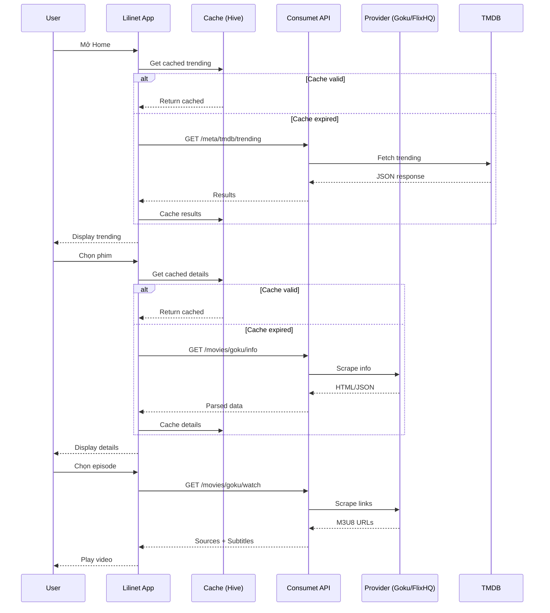

# Backend: Consumet API (Movie Data Source)

## 1. Giới Thiệu

**Consumet API** là một open-source API server (Node.js/TypeScript) cung cấp dữ liệu phim, anime, manga, và books bằng cách scrape từ các website public.

### 1.1 Vị Trí Trong Hệ Thống

```
Lilinet App (Flutter)
    ↓ HTTP/Dio
Consumet API (Node.js) ← Self-hosted
    ↓ Scrape
Various Movie/Anime Sites (FlixHQ, Goku, etc.)
```

### 1.2 Tại Sao Dùng Consumet?

| Ưu Điểm | Giải Thích |
|---------|-----------|
| **Unified API** | Một API cho nhiều sources |
| **Self-hosted** | Kiểm soát hoàn toàn, không phụ thuộc |
| **Free** | Không phí subscription |
| **Multiple Providers** | Fallback khi một source die |
| **Active Community** | Cập nhật thường xuyên |

### 1.3 Cảnh Báo Quan Trọng

> ⚠️ **Consumet scrape từ các sites public. Vui lòng:**
> - Tuân thủ Terms of Service của các sites
> - Không dùng cho commercial purposes
> - Self-host (không dùng public instance)
> - Hiểu legal implications trước khi deploy

---

## 2. Project Structure

```
api.consumet.org/
├── src/
│   ├── routes/
│   │   ├── anime/           # Anime providers
│   │   │   ├── animekai.ts
│   │   │   ├── animepahe.ts
│   │   │   ├── gogoanime.ts
│   │   │   └── ...
│   │   ├── movies/          # Movie providers ⭐
│   │   │   ├── flixhq.ts
│   │   │   ├── dramacool.ts
│   │   │   ├── goku.ts      # Đang dùng
│   │   │   ├── sflix.ts
│   │   │   └── himovies.ts
│   │   ├── manga/           # Manga providers
│   │   ├── meta/            # Metadata (TMDb, AniList, MAL)
│   │   └── ...
│   ├── models/
│   ├── utils/
│   └── main.ts
├── Dockerfile
└── package.json
```

---

## 3. Providers Đang Dùng Trong App

### 3.1 Movie Providers

| Provider | Endpoint | Mô Tả | Status |
|----------|----------|-------|--------|
| **Goku** | `/movies/goku` | Primary provider, phim/TV đa dạng | ✅ Active |
| FlixHQ | `/movies/flixhq` | Backup provider | ⚠️ Sometimes unstable |
| DramaCool | `/movies/dramacool` | Asian dramas | ✅ Good |
| SFlix | `/movies/sflix` | Alternative source | ⚠️ Rate limited |
| HiMovies | `/movies/himovies` | HD movies | ✅ Good |

### 3.2 Metadata Providers

| Provider | Endpoint | Mô Tả |
|----------|----------|-------|
| **TMDb** | `/meta/tmdb` | Movie info, images, trending |
| AniList | `/meta/anilist` | Anime metadata |
| MyAnimeList | `/meta/mal` | Alternative anime meta |

---

## 4. API Endpoints Chi Tiết

### 4.1 Trending Movies

**Endpoint:** `GET /meta/tmdb/trending`

**Parameters:**
- `page` (optional): Số trang, default = 1

**Response:**
```json
{
  "results": [
    {
      "id": "tv/watch-vincenzo-67953",
      "title": "Vincenzo",
      "image": "https://image.tmdb.org/t/p/w500/...jpg",
      "type": "TV Series",
      "rating": 8.5,
      "releaseDate": "2021-02-20"
    }
  ],
  "totalPages": 100,
  "currentPage": 1
}
```

**Usage trong app:**
```dart
// lib/core/constants/api_constants.dart
static const String trendingMovies = '/meta/tmdb/trending';

// Repository call
final response = await _dio.get(
  '${ApiConstants.baseUrl}${ApiConstants.trendingMovies}',
  queryParameters: {'page': page},
);
```

---

### 4.2 Search Movies

**Endpoint:** `GET /meta/tmdb/:query`

**Parameters:**
- `page` (optional): Trang kết quả

**Example:** `GET /meta/tmdb/inception?page=1`

**Response:**
```json
{
  "results": [
    {
      "id": "movie/watch-inception-12742",
      "title": "Inception",
      "image": "https://image.tmdb.org/t/p/w500/...jpg",
      "type": "Movie",
      "rating": 8.4,
      "releaseDate": "2010-07-15"
    }
  ]
}
```

---

### 4.3 Movie Info (Chi Tiết Phim)

**Endpoint:** `GET /movies/:provider/info`

**Parameters:**
- `id` (required): Movie ID từ search/trending

**Example:** `GET /movies/goku/info?id=tv/watch-vincenzo-67953`

**Response:**
```json
{
  "id": "tv/watch-vincenzo-67953",
  "title": "Vincenzo",
  "description": "An Italian mafia lawyer...",
  "type": "TV Series",
  "rating": "8.5",
  "releaseDate": "2021",
  "genres": ["Drama", "Action", "Comedy"],
  "image": "https://image.tmdb.org/t/p/original/...jpg",
  "cover": "https://image.tmdb.org/t/p/original/...jpg",
  "episodes": [
    {
      "id": "tv/watch-vincenzo-67953:1:1",
      "title": "Episode 1",
      "number": 1,
      "season": 1,
      "description": "...",
      "image": "..."
    }
  ]
}
```

**Usage trong app:**
```dart
static String getInfoEndpoint(String category, String provider) =>
    '/$category/$provider/info';

// Gọi API
final response = await _dio.get(
  '${ApiConstants.baseUrl}/movies/goku/info',
  queryParameters: {'id': movieId},
);
```

---

### 4.4 Streaming Links (Xem Phim)

**Endpoint:** `GET /movies/:provider/watch`

**Parameters:**
- `episodeId` (required): Episode ID từ movie info
- `server` (optional): Tên server (vidcloud, upcloud, etc.)

**Example:** `GET /movies/goku/watch?episodeId=tv/watch-vincenzo-67953:1:1`

**Response:**
```json
{
  "headers": {
    "Referer": "https://goku.sx/...",
    "User-Agent": "Mozilla/5.0..."
  },
  "sources": [
    {
      "url": "https://m3u8.example.com/video.m3u8",
      "quality": "1080p",
      "isM3U8": true
    },
    {
      "url": "https://m3u8.example.com/video-720.m3u8",
      "quality": "720p",
      "isM3U8": true
    }
  ],
  "subtitles": [
    {
      "url": "https://example.com/subtitle.vtt",
      "lang": "Vietnamese"
    },
    {
      "url": "https://example.com/subtitle-en.vtt",
      "lang": "English"
    }
  ]
}
```

**Quan Trọng:**
- `sources` có thể có nhiều quality levels
- `isM3U8 = true` nghĩa là HLS streaming
- `headers` cần được gửi khi request video segments
- `subtitles` có thể null hoặc empty

---

### 4.5 Available Servers

**Endpoint:** `GET /movies/:provider/servers`

**Parameters:**
- `episodeId` (required): Episode ID

**Response:**
```json
{
  "servers": [
    "VidCloud",
    "UpCloud",
    "MegaCloud"
  ]
}
```

---

## 5. Error Handling

### 5.1 Common Errors

| Status | Meaning | Handling |
|--------|---------|----------|
| `404` | Not found | Show "Không tìm thấy" |
| `500` | Server error | Retry sau 2s |
| `429` | Rate limited | Exponential backoff |
| `403` | Blocked | Thử provider khác |
| Timeout | Slow network | Show loading, retry |

### 5.2 Implementation trong App

```dart
// lib/core/network/dio_client.dart
class DioClient {
  Dio get dio {
    final dio = Dio(BaseOptions(
      baseUrl: ApiConstants.baseUrl,
      connectTimeout: ApiConstants.connectionTimeout,
      receiveTimeout: ApiConstants.receiveTimeout,
    ));

    // Retry interceptor
    dio.interceptors.add(RetryInterceptor(
      dio: dio,
      options: const RetryOptions(
        retries: 3,
        retryInterval: Duration(seconds: 2),
      ),
    ));

    // Error handling
    dio.interceptors.add(InterceptorsWrapper(
      onError: (error, handler) {
        if (error.response?.statusCode == 404) {
          // Show not found
        } else if (error.response?.statusCode == 429) {
          // Rate limited - slow down
        }
        return handler.next(error);
      },
    ));

    return dio;
  }
}
```

---

## 6. Caching Strategy

### 6.1 What to Cache?

| Data | Cache Duration | Reason |
|------|---------------|--------|
| Trending | 1 hour | Thay đổi thường xuyên |
| Search | No cache | Real-time results |
| Movie Info | 30 mins | Static data |
| Streaming links | No cache | Expire quickly |
| Images | 7 days | TMDB CDN handles this |

### 6.2 Implementation

```dart
// Caching với Hive
class MovieLocalDataSource {
  final Box<MovieModel> _trendingBox;
  final Box<MovieModel> _detailsBox;

  Future<void> cacheTrending(List<MovieModel> movies) async {
    await _trendingBox.clear();
    await _trendingBox.addAll(movies);
    await _trendingBox.put('lastUpdated', DateTime.now());
  }

  List<MovieModel>? getCachedTrending() {
    final lastUpdated = _trendingBox.get('lastUpdated') as DateTime?;
    if (lastUpdated == null) return null;
    
    if (DateTime.now().difference(lastUpdated) > Duration(hours: 1)) {
      return null; // Cache expired
    }
    
    return _trendingBox.values.toList();
  }
}
```

---

## 7. Provider Switching (Fallback)

### 7.1 Chiến Lược

Khi một provider fail, tự động chuyển sang provider khác:

```dart
class MovieRepositoryImpl implements MovieRepository {
  final List<String> _providers = ['goku', 'flixhq', 'dramacool'];
  
  @override
  Future<Either<Failure, Movie>> getMovieDetails(String id) async {
    for (final provider in _providers) {
      try {
        final result = await _fetchFromProvider(provider, id);
        return Right(result);
      } catch (e) {
        continue; // Thử provider tiếp theo
      }
    }
    return Left(Failure('All providers failed'));
  }
}
```

### 7.2 Provider Health Check

```dart
// Kiểm tra provider status trước khi dùng
Future<bool> isProviderHealthy(String provider) async {
  try {
    final response = await _dio.get('/movies/$provider');
    return response.statusCode == 200;
  } catch (_) {
    return false;
  }
}
```

---

## 8. Rate Limiting & Best Practices

### 8.1 Rate Limits

Consumet không có rate limit cứng, nhưng các sites gốc có:

| Provider | Approx Limit | Strategy |
|----------|-------------|----------|
| Goku | ~100 req/min | Cache aggressively |
| FlixHQ | ~60 req/min | Spread requests |
| TMDB | ~40 req/10s | Use sparingly |

### 8.2 Best Practices

1. **Cache mọi thứ có thể** - Giảm API calls
2. **Debounce search** - 500ms delay
3. **Lazy loading** - Pagination cho lists
4. **Retry với backoff** - Exponential backoff
5. **Offline mode** - Show cached data khi offline

---

## 9. Self-Hosting Guide

### 9.1 Docker (Recommended)

```bash
# Pull image
docker pull riimuru/consumet-api

# Run
docker run -d \
  -p 7030:3000 \
  -e NODE_ENV=PROD \
  -e PORT=3000 \
  --name consumet-api \
  riimuru/consumet-api
```

### 9.2 From Source

```bash
git clone https://github.com/consumet/api.consumet.org.git
cd api.consumet.org
npm install
npm start
```

### 9.3 Environment Variables

```env
NODE_ENV=PROD
PORT=3000
# Optional: Redis for caching
REDIS_URL=redis://localhost:6379
```

### 9.4 Deployment Options

| Platform | Difficulty | Cost |
|----------|-----------|------|
| **VPS/DigitalOcean** | Medium | $5-10/month |
| **Render** | Easy | Free tier |
| **Heroku** | Easy | $7/month |
| **Vercel** | Easy | Free (serverless) |
| **Railway** | Easy | Free tier |
| **Docker** | Medium | Self-managed |

**Khuyến nghị:** Dùng Render hoặc Railway cho bắt đầu.

---

## 10. Troubleshooting

### 10.1 Common Issues

**Issue:** "Cannot connect to API"
```
Solution: 
- Check if server is running
- Check firewall (port 7030 open)
- Check Android emulator (dùng 10.0.2.2 thay vì localhost)
```

**Issue:** "404 Not found"
```
Solution:
- Movie ID có thể đã bị xóa hoặc thay đổi
- Thử provider khác
- Update Consumet lên version mới nhất
```

**Issue:** "No streaming links"
```
Solution:
- Episode có thể chưa có sẵn
- Thử server khác
- Thử provider khác
```

**Issue:** "Rate limited"
```
Solution:
- Giảm số requests
- Thêm delay giữa các calls
- Cache nhiều hơn
```

### 10.2 Debugging

```bash
# Test API manually
curl http://localhost:7030/meta/tmdb/trending

# Check logs
docker logs consumet-api

# Enable debug mode (dev only)
NODE_ENV=DEV npm start
```

---

## 11. Sequence Diagram - Movie Data Flow



---

## 12. Activity Diagram - Provider Selection

```mermaid
activityDiagram
    start
    :User request movie;
    :Try primary provider (Goku);
    
    if (Success?) then (yes)
        :Return data;
    else (no)
        :Log error;
        :Try backup provider (FlixHQ);
        
        if (Success?) then (yes)
            :Return data;
        else (no)
            :Try tertiary provider (DramaCool);
            
            if (Success?) then (yes)
                :Return data;
            else (no)
                :Show error to user;
                :"Không thể tải dữ liệu";
            endif
        endif
    endif
    stop
```

---

## 13. Testing API

### 13.1 Unit Tests

```dart
// Mock Consumet responses
test('should return trending movies', () async {
  final mockDio = MockDio();
  when(mockDio.get(any)).thenAnswer(
    (_) async => Response(
      data: {'results': [...]},
      statusCode: 200,
    ),
  );
  
  final repo = MovieRepositoryImpl(mockDio);
  final result = await repo.getTrendingMovies();
  
  expect(result.isRight(), true);
});
```

### 13.2 Integration Tests

```dart
test('end-to-end: search to playback', () async {
  // 1. Search
  final search = await repository.searchMovies('inception');
  expect(search.results, isNotEmpty);
  
  // 2. Get info
  final movie = await repository.getMovieDetails(search.results.first.id);
  expect(movie.episodes, isNotEmpty);
  
  // 3. Get streaming
  final stream = await repository.getStreamingLinks(movie.episodes.first.id);
  expect(stream.sources, isNotEmpty);
});
```

---

## 14. Related Documentation

- [Consumet GitHub](https://github.com/consumet/api.consumet.org)
- [Consumet Extensions](https://github.com/consumet/consumet.ts) - Core scraping logic
- [TMDb API Docs](https://developers.themoviedb.org/3) - For metadata

---

## 15. Còn Thiếu / Cần Cải Thiện

- [ ] **Load balancing** - Nhiều Consumet instances
- [ ] **Redis caching** - Tích hợp Redis cho API
- [ ] **GraphQL wrapper** - Thay vì REST
- [ ] **Webhook support** - Real-time updates
- [ ] **Analytics** - Track API usage
- [ ] **Auto-scaling** - Based on demand
- [ ] **Circuit breaker** - Pattern cho failures
- [ ] **Request deduplication** - Tránh duplicate calls

---

*Document Version: 1.0*
*Last Updated: January 2026*
